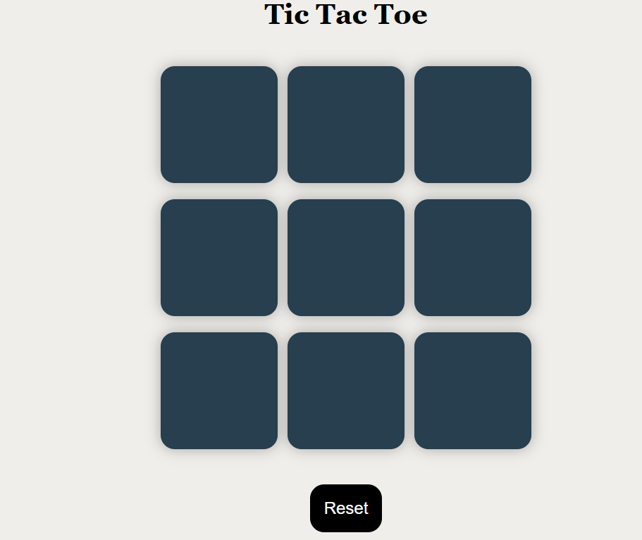

# 🎮 Tic Tac Toe Game

A simple, fun, and interactive **Tic Tac Toe** game built using **HTML, CSS, and JavaScript**. Play with a friend in your browser — complete with win detection, draw alerts, replay functionality, and sleek visual feedback!

---

## 🌐 Live Demo

👉 [Click to Play Online](https://prateeksri1308.github.io/Tic-Tac-Toe-Game/)

---

## 📸 Preview

  

---

## 🚀 Features

- ✅ Classic 3×3 grid gameplay  
- 🎮 2-player mode (X vs O)  
- ✨ Real-time visual feedback on win/draw  
- 🔄 "Play Again" button to reset the board  
- 🎨 Minimalist, clean, and responsive design  
- 🧠 Well-commented, beginner-friendly code  
- 🧩 Fully functional with no external libraries  

---

## 🛠️ Technologies Used

- **HTML5** – Structure  
- **CSS3** – Styling and layout  
- **JavaScript** – Game logic and interactivity  

---

## 📁 File Structure

Tic-Tac-Toe-Game/
├── index.html # Game layout
├── tictactoe.css # All styles
├── ticktactoe.js # Core game logic
├──tictaktoe.png # (Optional) Screenshot image
└── README.md # Project documentation

---

## 🚧 Possible Future Improvements

- 🤖 Add AI to play against computer  
- 🎨 Light/Dark mode toggle  
- 🔊 Sound effects on move/win  
- 📱 Mobile gesture support  

---

## 🧑‍💻 Author

**Prateek Srivastava**  
📚 BCA Student at UPES  
🌐 GitHub: [@Prateeksri1308](https://github.com/Prateeksri1308)

---

## 📜 License

This project is open-source and available for personal or educational use.  
Feel free to fork and modify as you like!

---

## 💬 Feedback

If you like the game or want to suggest features, feel free to open an issue or star the repo!  
Let's connect and build better together 🚀
